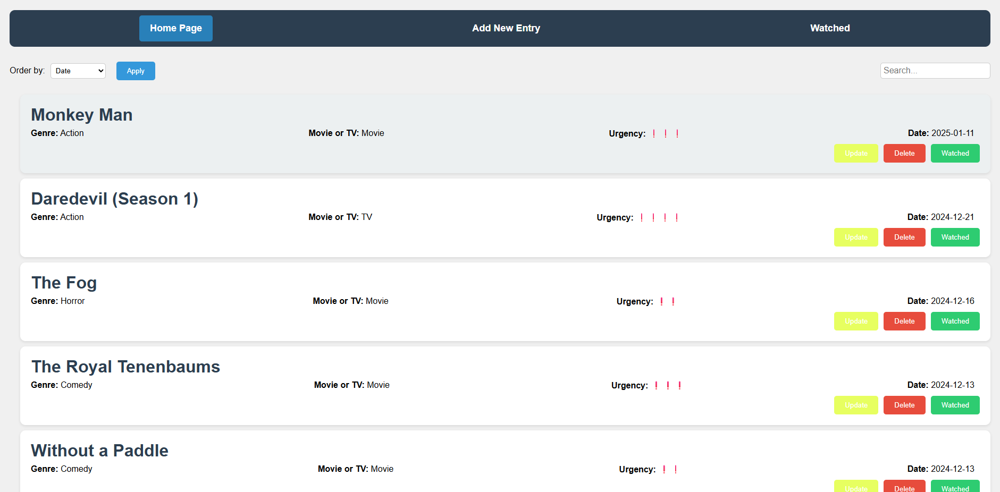

## Description

This is a website made for my girlfriend and I. It's basic funciton is to keep track of movies and TV shows that we would like to watch, as well as being able to rate them once they have been watched and add them to a list of completed shows. There is a second (unfinished) portion of this project which pulls all of the watched shows and generates interesting graphs about them. 

## Frontend

The frontend has the home page which will show all current shows to be watched, can be sorted based on date, urgency, etc.

There is a navigation bar at the top where you can navigate to the "Submit Page" where you can add new shows to be watched. As well as being able to navigate to the watched list to see all shows that have been watched. 

## Backend 

A Server written in javascript (I should have used python but too late) that handles all the requests to the Baserow database.